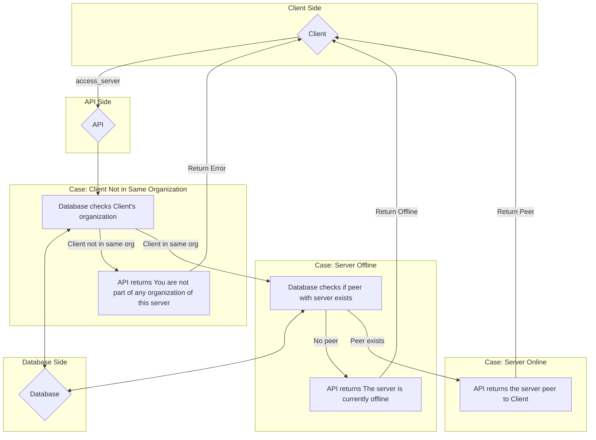

```mermaid
graph TD
subgraph Client Side
Client{Client}
end

    subgraph API Side
        API{API}
    end

    subgraph Database Side
        Database{Database}
    end

    subgraph Case: Client Not in Same Organization
        Database_Check_Org[Database checks Client's organization] <--> Database
        API_Returns_Error[API returns You are not part of any organization of this server]
    end

    subgraph Case: Server Offline
        Database_Check_Peer[Database checks if peer with server exists] <--> Database
        API_Returns_Offline[API returns The server is currently offline]
    end

    subgraph Case: Server Online
        API_Returns_Peer[API returns the server peer to Client]
    end

    Client -->|access_server| API
    API --> Database_Check_Org
    Database_Check_Org -->|Client not in same org| API_Returns_Error
    API_Returns_Error -->|Return Error| Client

    Database_Check_Org -->|Client in same org| Database_Check_Peer
    Database_Check_Peer -->|No peer| API_Returns_Offline
    API_Returns_Offline -->|Return Offline| Client

    Database_Check_Peer -->|Peer exists| API_Returns_Peer
    API_Returns_Peer -->|Return Peer| Client
```