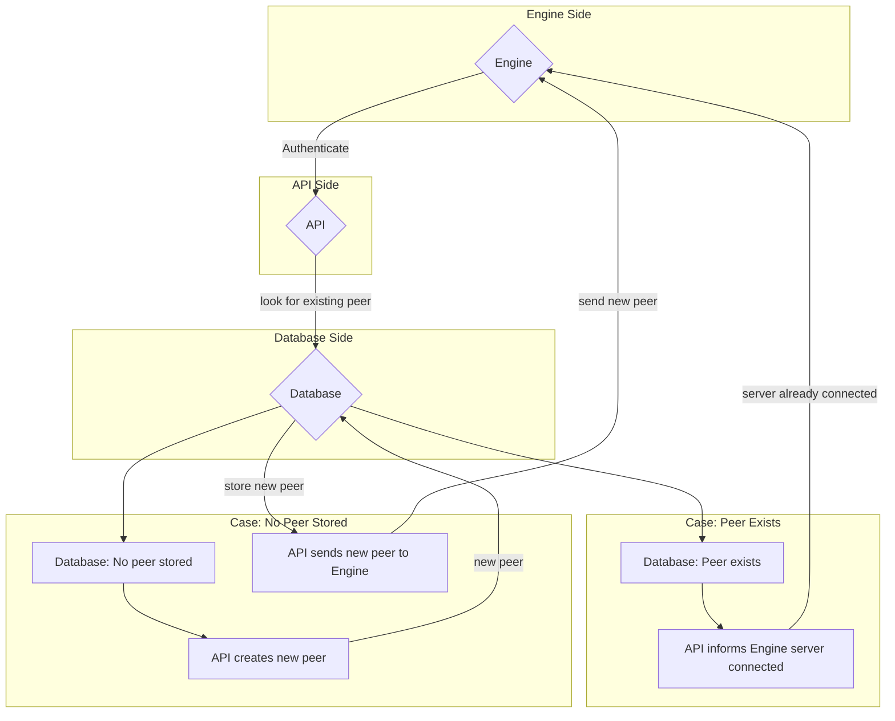

[return to list of guides](../../README.MD)
# Engine authentication with API

```mermaid
graph TD
subgraph Engine Side
Engine{Engine}
end

    subgraph API Side
        API{API}
    end

    subgraph Database Side
        Database{Database}
    end

    subgraph Case: Peer Exists
        Database_Peer_Exists[Database: Peer exists]
        API_Returns_Peer[API informs Engine server connected]
    end

    subgraph Case: No Peer Stored
        Database_No_Peer[Database: No peer stored]
        API_Creates_Peer[API creates new peer]
        API_Sends_New_Peer[API sends new peer to Engine]
    end

    Engine -->|Authenticate| API
    API -->|look for existing peer| Database

    Database --> Database_Peer_Exists
    Database_Peer_Exists --> API_Returns_Peer
    API_Returns_Peer -->|server already connected| Engine

    Database --> Database_No_Peer
    Database_No_Peer --> API_Creates_Peer
    API_Creates_Peer -->|new peer| Database
    Database -->|store new peer| API_Sends_New_Peer
    API_Sends_New_Peer -->|send new peer| Engine
```

[return to list of guides](../../README.MD)
