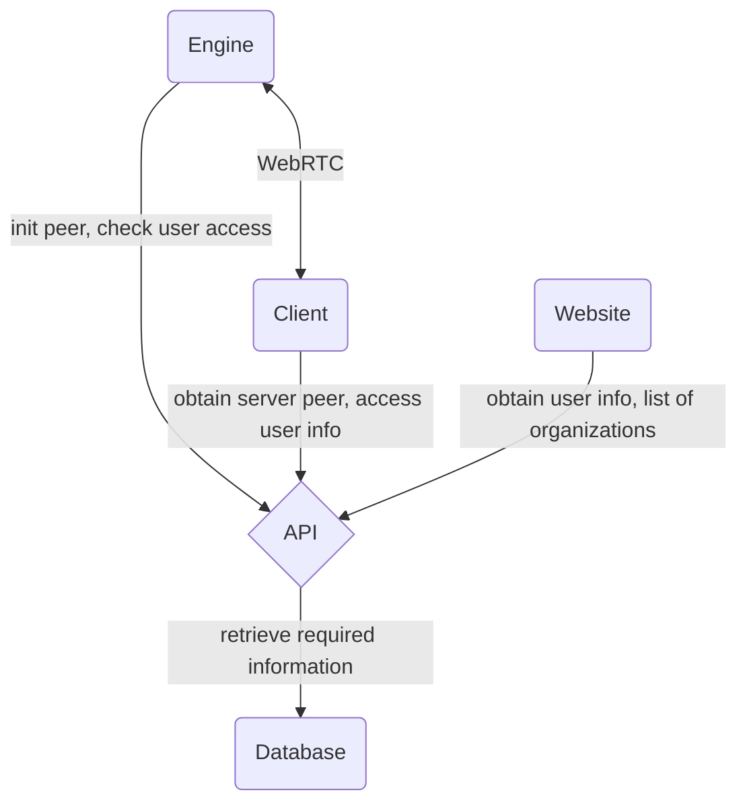

# Why a REST API?

### The project contains 3 main components
- Engine
- Client
- Website

### Therefore, to link the components with each other, the following architecture was thought

```mermaid
graph TD
    Engine(Engine)
    Client(Client)
    Website(Website)
    API{API}
    Database(Database)

    Engine <--->|WebRTC| Client
    Engine -->|init peer, check user access| API
    Client -->|obtain server peer, access user info| API
    Website -->|obtain user info, list of organizations| API
    API -->|retrieve required information| Database
```
